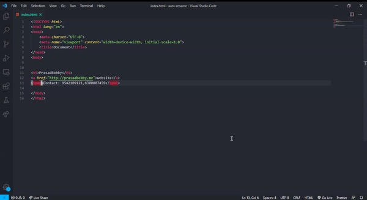

# Auto Rename Tag


Automatically rename paired HTML/XML tag, same as Visual Studio IDE does.


## Features

- When you rename one HTML/XML tag, automatically rename the paired HTML/XML tag

## Usages



## Configuration

Add entry into `auto-rename-tag.activationOnLanguage` to set the languages that the extension will be activated.
By default, it is `["*"]` and will be activated for all languages.

```json
{
  "auto-rename-tag.activationOnLanguage": ["html", "xml", "php", "javascript"]
}
```

The setting should be set with language id defined in [VS Code](https://github.com/Microsoft/vscode/tree/master/extensions). Taking [javascript definition](https://github.com/Microsoft/vscode/blob/master/extensions/javascript/package.json) as an example, we need to use `javascript` for `.js` and `.es6`, use `javascriptreact` for `.jsx`. So, if you want to enable this extension on `.js` file, you need to add `javascript` in settings.json.

## Note

From 1.44, VS Code offers the built-in [Rename On Type](https://code.visualstudio.com/updates/v1_44#_synced-regions) support for HTML and Handlebars that can be enabled with the setting `editor.renameOnType`. If this setting is enabled, this extension will skip HTML and Handlebars files regardless of the languages listed in `auto-rename-tag.activationOnLanguage`
<br>

## Developer
<p align="center">
  
</p>
  
<p align="center">
  <a href="http://prasadbobby.me">P r a s d &nbsp; B o b by</a><br>
  <br>
    <b>Technology Keen | Web & Desktop Application Developer | Music Addict</b>
  <br><br>
  <br>
  <a href="https://github.com/prasadbobby">Github </a>  |
  <a href="https://www.linkedin.com/in/prasad-bobby-705002161/">LinkedIn</a>  |
  <a href="https://www.instagram.com/___mr_introvert____/">Instagram</a>
  <br><br>
  
  <br>
   <b>knvdurgaprasad610@gmail.com</b>
  <br>
  
</p>